# Agentic AI Workloads – Ordered Slide Analysis and Multi-Agent Design Reference Notes

## Scope

- This document contains an ordered, evidence-first technical annotation of the uploaded slide images related to AI agents, agentic systems, protocols, evaluation, interoperability, safety, and engineering practice.
- The slide order was determined primarily from visible slide numbers. Titles, repeated captures, and archive filenames were used only as secondary validation signals.
- Duplicate or alternate captures were deduplicated by selecting the clearest readable version for the main chapter. Slides 15, 24, and 34 were reconstructed from composite-sheet crops because no standalone file for those slides was present in the extracted archives.
- The visible sequence is Slide 7, then Slides 9–34. Slide 8 was not visible in the uploaded set and was not reconstructed.
- Interpretations are phrased so they remain reusable for multi-agent systems, multi-model orchestration, model/tool boundaries, protocol-driven interoperability, layered evaluation, and safe deployment of agentic workflows.
- Constraints applied: no missing content was invented, no external frameworks or claims were added unless explicitly visible on the slides, and uncertain details are marked as such.

## Ordered Slide Analysis

### Slide 7 – GenAI, Agentic Systems and the spectrum of Autonomy

**Image URI:** `images/slide-07.png`

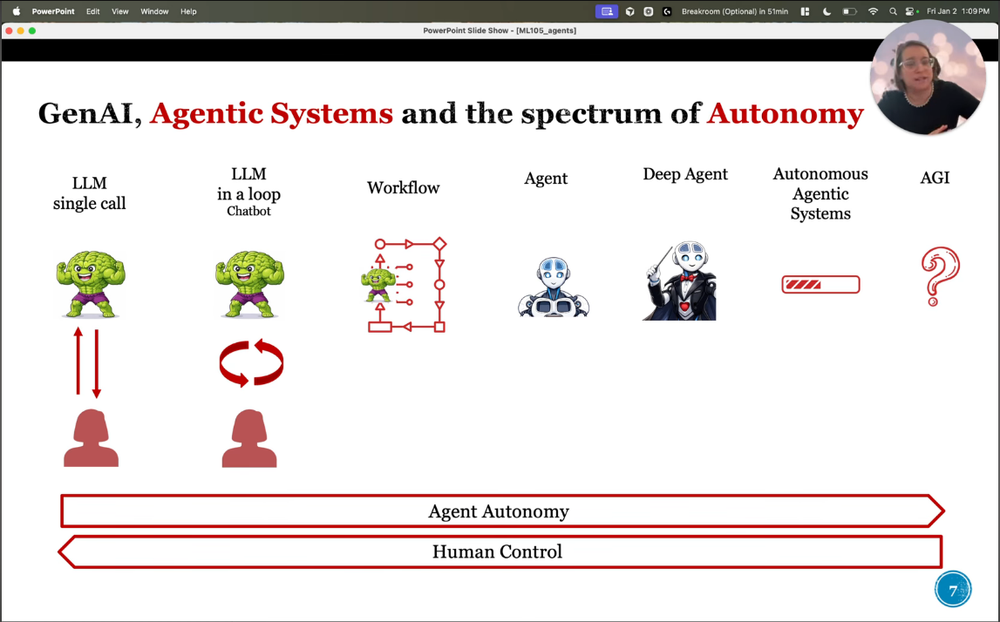

**Main Point:**
The slide places agentic systems on an autonomy continuum that runs from single model calls toward increasingly autonomous systems, while human control decreases as autonomy rises.

#### What the slide shows

- An ordered spectrum: LLM single call, LLM in a loop / chatbot, workflow, agent, deep agent, autonomous agentic systems, and AGI.
- Human figures under the first two stages and loop arrows under chatbot emphasize stronger human involvement in low-autonomy patterns.
- A workflow icon, robot figures, a partially filled bar for autonomous systems, and a question mark for AGI signal progressively less-settled stages.
- Two bottom arrows summarize the trade-off: agent autonomy increases left-to-right, while human control points in the opposite direction.

#### Core concept

- The slide frames agentic design as a control-topology choice rather than a binary “agent / non-agent” distinction.
- It distinguishes static orchestration, agent execution, and more autonomous future-facing systems as different operating modes.
- The visual ordering implies that autonomy is incremental and layered, not an all-at-once capability jump.

#### Detailed interpretation

- The first stage is a direct LLM invocation with a simple request/response pattern.
- The second stage adds repeated interaction, represented as a chatbot loop, but still remains close to direct user steering.
- The workflow stage is shown as a fixed flow graph, which implies pre-defined control logic rather than runtime-devised behavior.
- The agent and deep agent stages introduce robot figures, signaling a stronger software-entity framing with reasoning and action capabilities.
- The “autonomous agentic systems” position is intentionally incomplete on the slide; the partially filled bar suggests an emerging frontier rather than a fully specified mature category.
- AGI is represented only by a question mark, which indicates conceptual reach rather than an operational system definition.

#### Technical implications / engineering relevance

- Architecture decisions should start with the minimum autonomy required for the task; not every workload requires an agentic control loop.
- The slide implies that increasing autonomy increases the need for guardrails, observability, approval gates, and production controls.
- Workflow systems and agentic systems should be treated as different execution models with different reliability and debugging profiles.
- For multi-agent design, this spectrum is a useful framing device for selecting the appropriate orchestration boundary.

#### Key takeaways

- Autonomy exists on a spectrum, not as a single category.
- Human control and system autonomy are in tension and must be balanced deliberately.
- Workflow, agent, and deep-agent patterns should not be conflated.

### Slide 9 – What is an Agent?

**Image URI:** `images/slide-09.png`

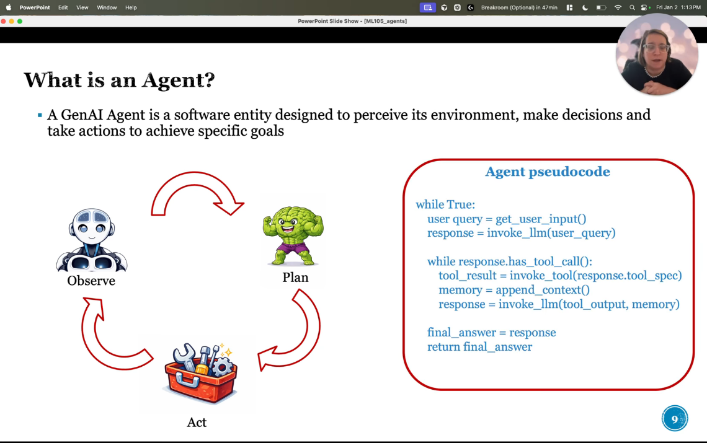

**Main Point:**
The slide defines a GenAI agent as a software entity that observes, plans, and acts, using a loop that can repeatedly invoke tools before producing a final answer.

#### What the slide shows

- A definition sentence: a GenAI agent is designed to perceive its environment, make decisions, and take actions to achieve specific goals.
- A three-part control loop labeled Observe, Plan, and Act.
- A pseudocode panel titled “Agent pseudocode”.
- The pseudocode shows user input, an LLM invocation, iterative tool calls, memory updates, and final response return.

#### Core concept

- An agent is presented as a closed-loop controller rather than a one-shot text generator.
- Tool use is part of the execution path, not an external add-on.
- Memory is explicitly updated inside the loop, which makes context management a first-class concern.

#### Detailed interpretation

- The control loop visually cycles from observation to planning to action, making runtime iteration the defining characteristic.
- The pseudocode starts with a user query and an initial `invoke_llm` call.
- If the response contains a tool call, the system invokes the tool, appends context to memory, and invokes the model again using the tool output and memory.
- The loop terminates only when no further tool call is required and the response can be returned as the final answer.
- This is a grounded description of an agent loop with tool mediation, context transport, and a termination condition.

#### Technical implications / engineering relevance

- Agent runtimes need explicit loop control, termination safeguards, and tool-execution plumbing.
- Memory handling is not optional; it directly affects reasoning continuity and tool-follow-up behavior.
- Production implementations need controls against infinite loops, repeated failed actions, malformed tool invocations, and other failure modes that become more severe when orchestration spans several steps or components.
- This slide is a direct precursor to later topics on tools, memory, evaluation, protocol boundaries, and architecture patterns.

#### Key takeaways

- An agent is a looped software entity, not only a model call.
- Tool invocation and memory updates are built into the operational definition.
- The agent output is the result of iterative path execution, not just prompt completion.

### Slide 10 – What is an Agent?

**Image URI:** `images/slide-10.png`

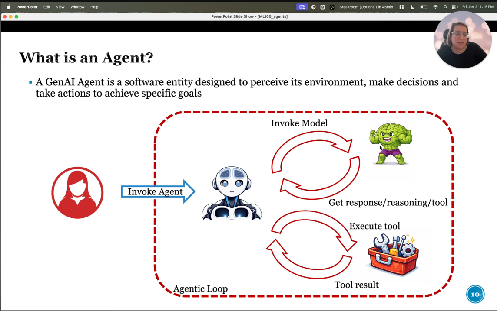

**Main Point:**
The slide operationalizes the agent definition as an interaction loop in which a person invokes an agent that repeatedly coordinates model reasoning and tool execution inside an “agentic loop”.

#### What the slide shows

- A human icon on the left, an “Invoke Agent” arrow, and a dashed boundary labeled “Agentic Loop”.
- Within the boundary: the agent, an “Invoke Model” loop, and a separate “Execute tool” loop.
- Labels such as “Get response/reasoning/tool” and “Tool result”.
- The full sequence from user request to model reasoning to tool execution and back.

#### Core concept

- The slide emphasizes agent mediation between user intent and runtime execution.
- It separates model reasoning from tool execution while still connecting them in one control loop.
- The dashed enclosure communicates that the loop is a bounded software subsystem.

#### Detailed interpretation

- The user does not directly operate the model and tools separately; the user invokes the agent as the orchestration endpoint.
- The agent invokes the model to obtain reasoning, tool intent, or intermediate response state.
- When tool use is required, the agent executes the tool, obtains a result, and routes that result back into the loop.
- The use of two circular sub-loops makes an important distinction: reasoning and action are coupled but not identical operations.
- The slide therefore grounds the agent concept in control flow, not persona or interface styling.

#### Technical implications / engineering relevance

- Agent runtimes should isolate user-facing interfaces from internal reasoning and tool orchestration layers so that interaction boundaries remain stable as systems grow more modular.
- This pattern motivates clear boundaries between model invocation, tool adapters, and loop state management.
- Observability should capture both reasoning turns and tool execution turns, because they are distinct execution events with different failure and accountability characteristics.
- Failure handling should also distinguish model failures from tool failures and handoff failures between them.

#### Key takeaways

- The agent is the execution mediator between user and system capabilities.
- Model calls and tool calls form one runtime loop but remain separate subsystems.
- Agent engineering requires orchestration logic, not only prompt design.

### Slide 11 – What is an Agent? Agents vs Workflows

**Image URI:** `images/slide-11.png`

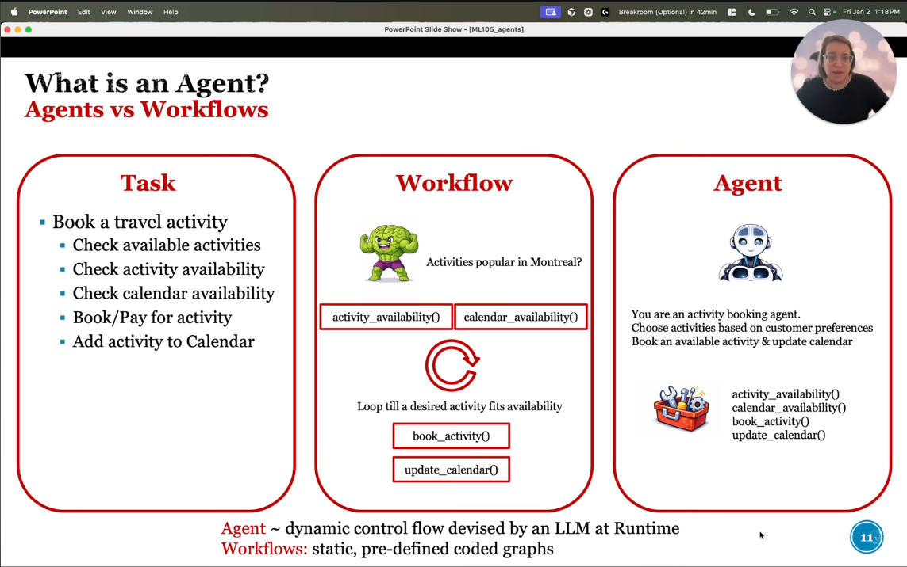

**Main Point:**
The slide contrasts workflows as static, pre-defined coded graphs with agents as runtime-devised control flows driven by an LLM.

#### What the slide shows

- Three columns: Task, Workflow, and Agent.
- The task example is “Book a travel activity” with substeps such as checking availability, checking calendar availability, booking/paying, and updating the calendar.
- The workflow column shows fixed functions such as `activity_availability()`, `calendar_availability()`, `book_activity()`, and `update_calendar()`.
- The agent column describes an activity booking agent that chooses activities based on customer preferences and then invokes the same capability set.

#### Core concept

- The same business problem can be implemented either as a fixed workflow graph or an agentic runtime.
- In the workflow, the path is explicitly scripted; in the agent, the path is determined dynamically.
- The distinction is about control strategy, not merely about whether tools exist.

#### Detailed interpretation

- The task decomposition is identical across both approaches, which makes the comparison structurally fair.
- The workflow path is shown as a fixed orchestration sequence plus a loop until an activity matches availability constraints.
- The agent version replaces explicit path scripting with natural-language instruction: it is told to choose activities based on customer preferences and book/update accordingly.
- The capability interface in the agent column still includes the same functions, which shows that tools may be shared across workflow and agent implementations.
- The bottom caption states the distinction directly: agents use dynamic control flow devised by an LLM at runtime, while workflows are static coded graphs.

#### Technical implications / engineering relevance

- Where business logic is stable and predictable, workflows provide stronger determinism and simpler debugging.
- Where path selection depends on open-ended reasoning or user preference synthesis, agentic control may reduce explicit coding burden.
- Tool schemas should be designed so they can serve both workflow orchestration and agentic orchestration while preserving stable model/tool boundaries.
- The workflow-versus-agent decision is an architecture decision about runtime control, reliability, and maintenance.

#### Key takeaways

- Agents and workflows can solve the same task with different control topologies.
- Dynamic runtime planning is the defining feature of the agent column.
- Agent adoption should be justified by the path-selection problem, not by fashion.

### Slide 12 – Agent Use Cases

**Image URI:** `images/slide-12.png`

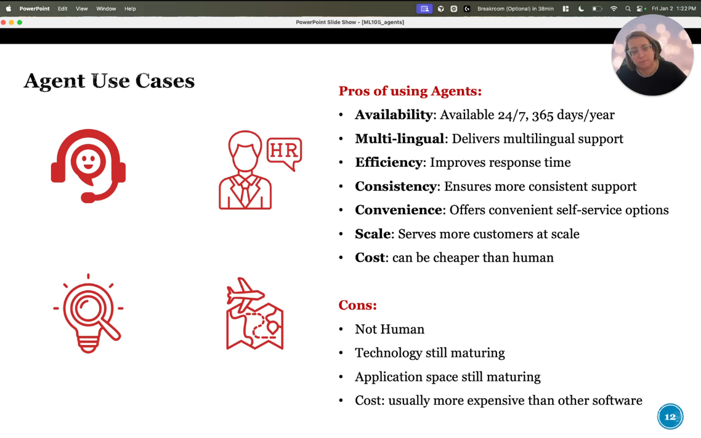

**Main Point:**
The slide positions agents as useful for always-on, multilingual, scalable support-like use cases, while also acknowledging maturity, cost, and human-likeness limitations.

#### What the slide shows

- A title “Agent Use Cases” plus icons suggesting support, HR/persona, search/insight, and navigation or mapping contexts.
- A pros list: availability, multi-lingual support, efficiency, consistency, convenience, scale, and potential cost advantage versus humans.
- A cons list: not human, technology still maturing, application space still maturing, and cost often higher than conventional software.
- The slide is framed as a balanced trade-off view rather than a pure advocacy slide.

#### Core concept

- Agents are presented as especially attractive where service continuity, language coverage, and scale matter.
- The limitations emphasize that agents are not interchangeable with humans and not universally cheaper than other software approaches.
- The slide distinguishes agent value from simple hype by making trade-offs explicit.

#### Detailed interpretation

- The availability claim explicitly references 24/7, 365-day operation, which aligns with service workloads that benefit from continuous coverage.
- Multi-lingual delivery is framed as a direct operational advantage for support and communication-heavy workloads.
- Efficiency and consistency are treated as service-quality characteristics rather than purely model-quality metrics.
- The scale bullet highlights parallel service reach, which is a deployment property rather than a reasoning property.
- The cons section is equally important: the slide warns that agents are not human, that the technology and application space are still maturing, and that agents may still be more expensive than conventional software systems.

#### Technical implications / engineering relevance

- Use-case selection should be driven by service characteristics such as coverage, throughput, and interaction variability.
- Cost modeling must compare agents not only to human labor but also to simpler automation and conventional software.
- Human expectations management remains necessary because the slide explicitly states “not human”.
- Agent suitability should be assessed at the application boundary, not only at the model boundary.

#### Key takeaways

- Agent value is strongest where availability, language coverage, and scale are operationally important.
- Maturity and cost remain non-trivial constraints.
- Use-case selection should be trade-off based, not assumption based.

### Slide 13 – Patterns and Anti-Patterns for Agents – When to use, or not to use an agent

**Image URI:** `images/slide-13.png`

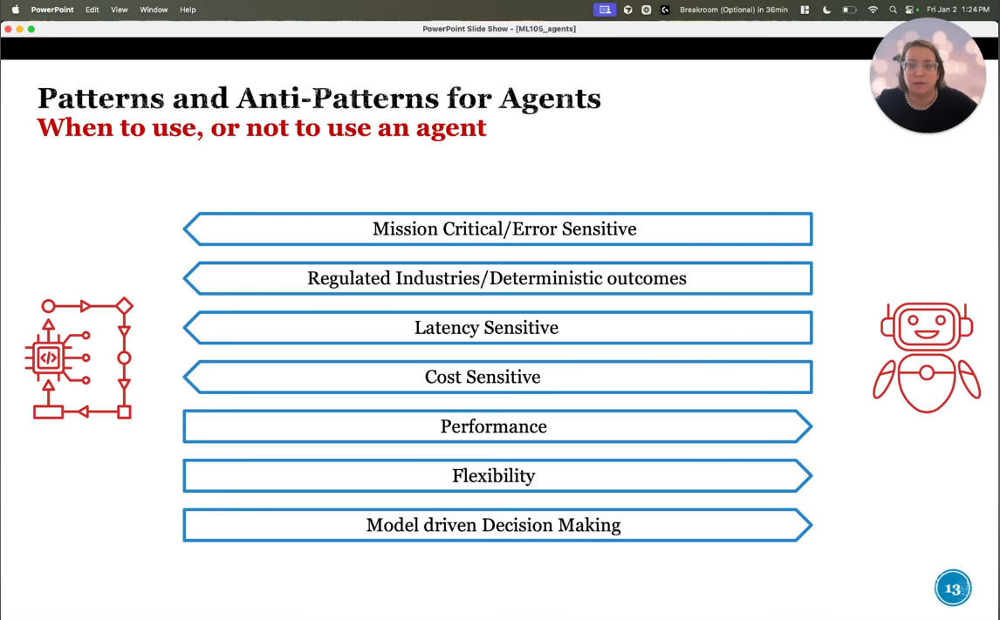

**Main Point:**
The slide maps agent fit across opposing conditions, indicating that agents are generally weaker for mission-critical, deterministic, latency-sensitive, or cost-sensitive workloads and stronger where flexibility and model-driven decision making matter.

#### What the slide shows

- A stacked comparison with seven criteria: mission critical/error sensitive, regulated industries/deterministic outcomes, latency sensitive, cost sensitive, performance, flexibility, and model driven decision making.
- A workflow-like icon on the left and a robot icon on the right.
- The top four bars point toward the workflow side; the bottom three bars point toward the agent side.
- The slide uses directional arrows instead of prose to convey fit preference.

#### Core concept

- The visual encodes a design heuristic: agents are not the default choice under strict determinism and low tolerance for error.
- Flexibility and model-driven decision making are the primary fit criteria favoring agentic execution.
- The slide treats agent adoption as a pattern/anti-pattern problem rather than a capability contest.

#### Detailed interpretation

- Mission-critical and error-sensitive workloads are visually aligned away from the agent side, implying stronger need for predictable control and lower tolerance for compounding error.
- Regulated industries and deterministic outcomes are grouped together, suggesting that hard constraints and explicit outcome traceability favor non-agentic orchestration.
- Latency and cost sensitivity are likewise shown as anti-agent conditions, which is consistent with multi-turn reasoning and tool-use overhead.
- The lower part of the figure reverses direction for performance, flexibility, and model-driven decision making; the slide therefore implies that when open-ended reasoning value dominates, agents become more defensible.
- The figure does not quantify thresholds; it is a qualitative decision aid.

#### Technical implications / engineering relevance

- Architecture reviews should treat determinism, latency, and cost as gating criteria for agent adoption.
- Agentic paths are more defensible when the workflow topology would otherwise become brittle or excessively hard-coded.
- In regulated or mission-critical systems, agents may need to be confined behind deterministic approval boundaries.
- This slide provides a practical pre-screen for deciding whether agentic orchestration is appropriate at all.

#### Key takeaways

- Agents are best reserved for open-ended, flexible, model-mediated decision spaces.
- High-assurance, deterministic environments are anti-pattern territory for unconstrained agents.
- Fit assessment should be explicit and criterion-driven.

### Slide 14 – Patterns and Anti-Patterns for Agents – When to use, or not to use an agent

**Image URI:** `images/slide-14.png`

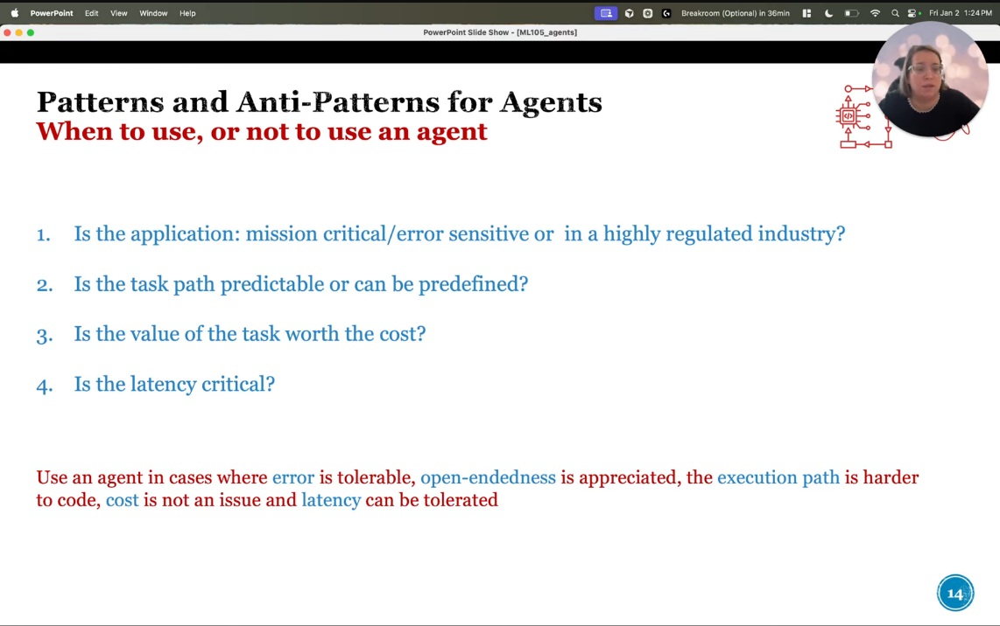

**Main Point:**
The slide turns the previous fit map into a concrete four-question decision checklist for deciding whether an agent is appropriate.

#### What the slide shows

- Four questions: whether the application is mission critical / error sensitive or highly regulated; whether the task path is predictable or predefinable; whether the value is worth the cost; and whether latency is critical.
- A concluding sentence recommending agents where error is tolerable, open-endedness is appreciated, the execution path is harder to code, cost is not an issue, and latency can be tolerated.
- A continuation of the “patterns and anti-patterns” framing.
- No new diagram; the slide is an explicit decision rubric.

#### Core concept

- The slide converts abstract fit criteria into an architecture review checklist.
- The positive case for agents is clearly scoped: tolerate error, value open-endedness, accept higher cost, and tolerate latency.
- The questions focus on application characteristics, not model benchmark scores.

#### Detailed interpretation

- The first question addresses safety, regulation, and failure tolerance at the system boundary.
- The second question asks whether the execution path can already be specified deterministically; if so, a workflow may be preferable.
- The third question introduces economic justification, making agent adoption a value-for-cost decision rather than a pure capability decision.
- The fourth question makes latency a first-class operational requirement.
- The final sentence is especially important because it states the recommended use case in plain engineering terms: open-ended tasks that are harder to code explicitly and can tolerate cost and latency overhead.

#### Technical implications / engineering relevance

- This slide can be used as a lightweight architecture gate before deeper prototyping.
- Teams should record explicit answers to these questions when proposing agentic features.
- Where the checklist fails, fallback designs should prefer workflows, deterministic logic, or simpler LLM-assisted components.
- The checklist is useful for governance because it ties agent adoption to risk and performance constraints.

#### Key takeaways

- Agent adoption should pass a structured decision checklist.
- Open-endedness and hard-to-code execution paths are the positive signal.
- Error sensitivity, determinism, cost pressure, and latency pressure are negative signals.

### Slide 15 – Components of an Agent

**Image URI:** `images/slide-15.png`

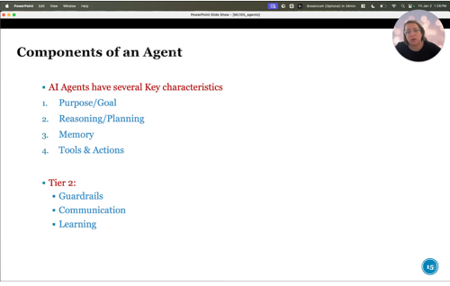

**Main Point:**
The slide defines the core agent component set as purpose, reasoning/planning, memory, and tools/actions, then adds a second tier of guardrails, communication, and learning.

#### What the slide shows

- A heading “Components of an Agent”.
- A list of key characteristics: purpose/goal, reasoning/planning, memory, and tools & actions.
- A separate “Tier 2” list: guardrails, communication, and learning.
- The structure is hierarchical rather than diagrammatic.

#### Core concept

- The slide separates primary execution components from secondary operational or developmental capabilities.
- Purpose, reasoning, memory, and action are treated as the irreducible core of an agent.
- Guardrails, communication, and learning are presented as augmenting layers rather than optional decorations.

#### Detailed interpretation

- Purpose/goal defines the task boundary and intended behavior target.
- Reasoning/planning represents the internal decision and decomposition capability.
- Memory captures context persistence across turns or tasks.
- Tools & actions provide outward-facing execution capability.
- The Tier 2 items indicate that safe operation, interface exchange, and capability improvement sit above the core runtime loop.
- The slide does not define how learning is implemented; it simply positions it as a secondary layer.

#### Technical implications / engineering relevance

- Agent architecture documents should explicitly specify all four core components, not only the model and prompt, because these same components recur when systems are decomposed into multiple cooperating agents.
- Guardrails need to be engineered as a system feature, not assumed to emerge from prompting alone.
- Communication is relevant to both user interfaces and multi-agent interoperability.
- The slide supports a layered design approach in which learning and guardrails are added around a stable core agent runtime and can later be elevated to system-level controls in larger agentic topologies.

#### Key takeaways

- An agent is a composed system with distinct functional parts.
- Guardrails and communication deserve explicit treatment as second-tier engineering concerns.
- Memory and tools are co-equal with reasoning, not optional extras.

### Slide 16 – Designing an Agent

**Image URI:** `images/slide-16.png`

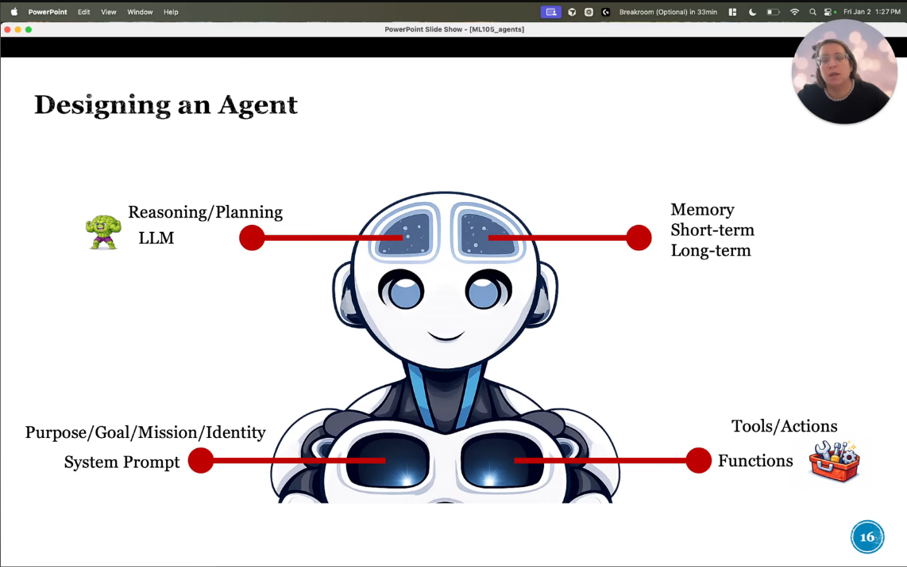

**Main Point:**
The slide presents agent design as the integration of four major subsystems: reasoning/planning, purpose or identity via system prompt, memory, and tools/actions.

#### What the slide shows

- A robot figure with four labeled connection points.
- Upper left: reasoning/planning with LLM.
- Lower left: purpose/goal/mission/identity and system prompt.
- Upper right: memory with short-term and long-term; lower right: tools/actions with functions.

#### Core concept

- Agent design is shown as a systems-integration exercise across cognition, identity, memory, and execution interfaces.
- The slide explicitly links system prompt to purpose/mission/identity, not only formatting or tone.
- Memory is already decomposed into short-term and long-term forms.

#### Detailed interpretation

- The slide visually centers the agent while distributing responsibilities across four connected axes.
- The reasoning/planning side ties the agent to an LLM as the decision engine.
- The purpose/goal/mission/identity side ties role definition to the system prompt, implying that prompt design is part of behavioral specification.
- The memory side distinguishes temporal persistence levels, which anticipates the dedicated memory slide.
- The tools/actions side identifies functions as the vehicle for outward action, which anticipates later discussion of APIs, browser actions, code execution, and related tooling.

#### Technical implications / engineering relevance

- Agent specification should document each of these four design axes separately so that role decomposition and later multi-agent specialization remain tractable.
- Identity and mission belong in system-level instructions and governance artifacts, not only in ad hoc prompts.
- Memory architecture should be selected intentionally because it affects planning continuity and retrieval behavior.
- Tool surfaces should be designed as explicit interfaces with stable schemas and permissions.

#### Key takeaways

- Agent design is multi-dimensional, not just model selection.
- System prompt, memory, and tool surfaces are structural components of the design.
- This slide functions as a blueprint for later design decisions.

### Slide 17 – Designing an Agent – Choosing an LLM

**Image URI:** `images/slide-17.png`

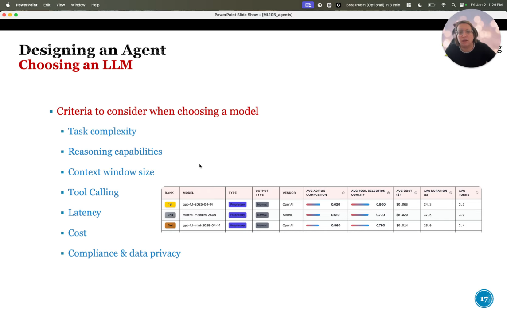

**Main Point:**
The slide frames model selection as a multi-criteria engineering decision based on task complexity, reasoning, context window, tool calling, latency, cost, and compliance/privacy.

#### What the slide shows

- A bullet list titled “Criteria to consider when choosing a model”.
- Criteria: task complexity, reasoning capabilities, context window size, tool calling, latency, cost, and compliance & data privacy.
- A comparison table ranking three models with fields such as rank, model, type, output type, vendor, average action completion, average tool selection quality, average cost, average duration, and average turns.
- The table demonstrates comparative benchmarking rather than abstract model preference.

#### Core concept

- Model choice is presented as a workload-specific selection problem rather than a universal best-model problem.
- Action completion and tool selection quality are treated as relevant to agentic workloads, not only generic model quality.
- Operational considerations such as cost, latency, and privacy appear alongside reasoning quality.

#### Detailed interpretation

- The criteria list spans capability, interface, and deployment concerns, which indicates that model selection is inseparable from system design.
- Task complexity and reasoning capability determine whether the model can support the intended planning burden.
- Context window size affects how much state can be carried natively before external memory becomes necessary.
- Tool calling is explicitly listed, which is particularly relevant for agent runtimes that rely on structured action invocation.
- The benchmark table shows ranked models and operational metrics, but the slide does not claim that one ranking is universal across all workloads.
- The inclusion of compliance and data privacy makes the slide production-oriented rather than purely benchmark-oriented.

#### Technical implications / engineering relevance

- Model evaluation for agents should include tool-use behavior and not only text quality.
- Teams should benchmark on task-relevant agent metrics such as action completion and tool-selection quality.
- Latency and cost trade-offs are central because agentic execution can amplify both through iterative loops.
- Model choice should remain revisitable as workload requirements change, especially when orchestration may later span more than one model or provider.

#### Key takeaways

- LLM selection is a multi-factor engineering decision.
- Agent workloads require model metrics beyond generic chat quality.
- Privacy, cost, and latency belong in the same decision frame as reasoning ability.

### Slide 18 – Designing an Agent – System prompt

**Image URI:** `images/slide-18.png`

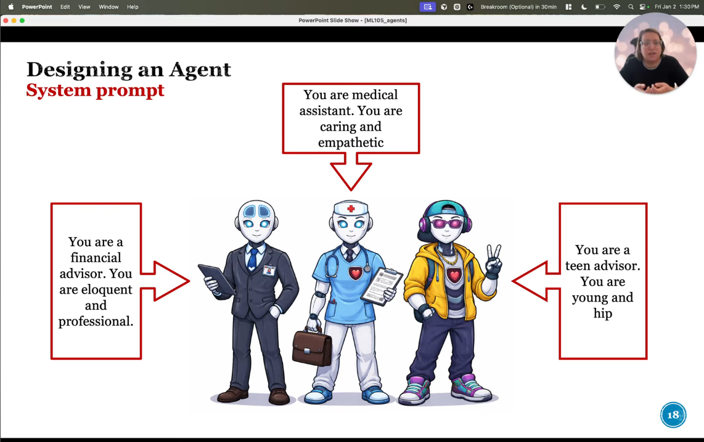

**Main Point:**
The slide shows that system prompts define agent identity and behavioral stance by conditioning the same agentic core into different domain roles.

#### What the slide shows

- Three role framings applied to robot personas: financial advisor, medical assistant, and teen advisor.
- Each role includes behavior cues such as eloquent/professional, caring/empathetic, and young/hip.
- The slide title explicitly names the system prompt as the design instrument.
- The visual contrast shows persona and domain adaptation without changing the basic agent metaphor.

#### Core concept

- The system prompt is treated as a behavioral specification layer.
- Identity is not cosmetic; it shapes style, tone, domain positioning, and likely decision framing.
- The same underlying agent can be specialized through prompt-level role definition.

#### Detailed interpretation

- The left example frames the agent as a financial advisor and emphasizes professionalism and eloquence.
- The center example frames the agent as a medical assistant and emphasizes caring and empathy.
- The right example frames the agent as a teen advisor and emphasizes youthfulness and informality.
- The slide therefore uses role differentiation to argue that system prompts encode mission-aligned interaction behavior.
- No claim is made that prompting alone is sufficient for domain safety; the slide only demonstrates identity shaping.

#### Technical implications / engineering relevance

- System prompts should be treated as controlled configuration artifacts, especially for domain-specific agents.
- Behavioral instructions should align with the application role and expected interaction contract.
- Prompt governance matters because identity framing can alter user trust, action suggestions, and communication style.
- For multi-agent systems, system prompts may serve as part of agent specialization and role partitioning, provided those roles remain backed by explicit boundaries and permissions.

#### Key takeaways

- System prompts define role and interaction posture.
- Agent specialization can be prompt-mediated even when the execution core remains similar.
- Prompt design is a substantive architecture input, not only a wording exercise.

### Slide 19 – Designing an Agent – Memory

**Image URI:** `images/slide-19.png`

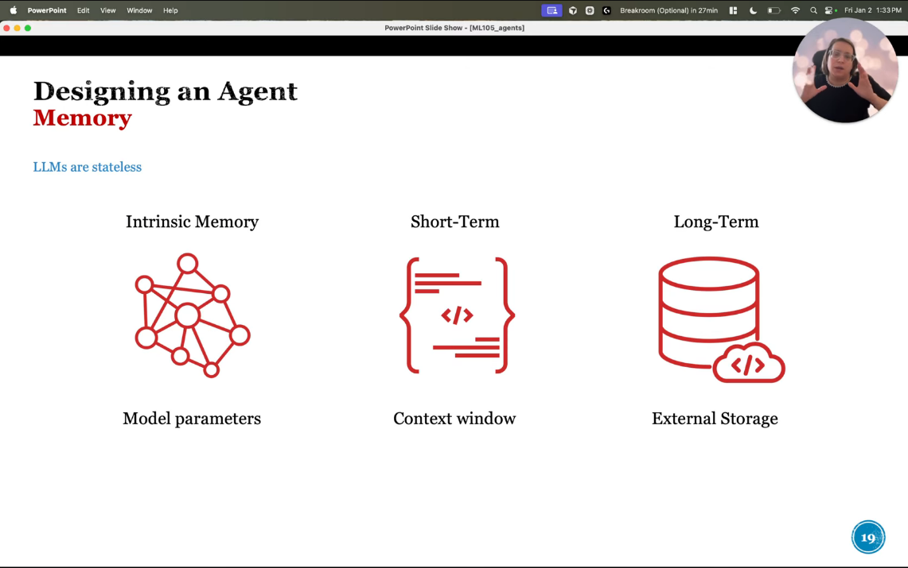

**Main Point:**
The slide distinguishes intrinsic, short-term, and long-term memory because LLMs are stateless and therefore need explicit memory mechanisms to preserve context and information across execution.

#### What the slide shows

- A note stating “LLMs are stateless”.
- Three memory categories: intrinsic memory, short-term, and long-term.
- Intrinsic memory is associated with model parameters.
- Short-term is associated with context window, and long-term with external storage.

#### Core concept

- Memory is decomposed by storage locus and temporal function.
- The slide separates what is encoded in model weights from what is carried in active context and what is stored externally.
- This is a foundational distinction for agent design because not all memory problems should be solved with larger prompts.

#### Detailed interpretation

- Intrinsic memory is represented as model parameters, which suggests capabilities and knowledge already embedded in the model.
- Short-term memory is represented as the active context window, which is limited and session-bound.
- Long-term memory is represented as external storage, which implies retrieval and persistence infrastructure outside the model.
- The slide’s “LLMs are stateless” statement is the justification for this decomposition: any durable continuity must be engineered explicitly.
- The slide does not prescribe one storage technology; it only establishes the memory categories.

#### Technical implications / engineering relevance

- Agent systems need explicit context-management strategies and retrieval boundaries so that memory flow remains inspectable across turns, tools, or cooperating agents.
- Long-term memory introduces storage design, retrieval quality, ranking, and data-governance considerations.
- Short-term context should be managed as an execution resource with token and relevance constraints.
- Memory design affects reliability, personalization, and tool-mediated reasoning quality.

#### Key takeaways

- LLMs do not provide persistent state by default.
- Memory architecture has at least three layers: model parameters, context window, and external storage.
- Agent quality depends heavily on how these layers are orchestrated.

### Slide 20 – Designing an Agent – Actions & Tools

**Image URI:** `images/slide-20.png`

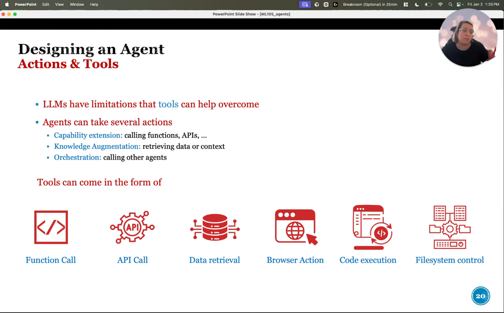

**Main Point:**
The slide presents tools as the mechanism by which agents overcome LLM limitations, extend capability, retrieve knowledge, and orchestrate actions across systems.

#### What the slide shows

- A statement that LLMs have limitations that tools can help overcome.
- A statement that agents can take several actions, followed by three subpoints: capability extension, knowledge augmentation, and orchestration.
- A list of tool forms: function call, API call, data retrieval, browser action, code execution, and filesystem control.
- Icons for each tool type.

#### Core concept

- Tools are positioned as first-class capability extensions, not optional add-ons.
- The slide groups tool value into execution, retrieval, and orchestration.
- Tool diversity spans both digital actions and information access.

#### Detailed interpretation

- Capability extension includes calling functions and APIs, which expands the model beyond pure text generation.
- Knowledge augmentation is explicitly tied to retrieving data or context, which connects this slide to memory and retrieval design.
- Orchestration is described as calling other agents, which introduces multi-agent composition as a tool-mediated pattern.
- The concrete tool categories range from structured calls to browser actions, code execution, and filesystem control, each implying a different risk and permission model.
- The slide therefore links tool choice directly to action surface and system reach.

#### Technical implications / engineering relevance

- Tool interfaces need explicit schemas, permissions, and error handling so that model/tool boundaries remain inspectable and governable.
- Browser, code, and filesystem actions imply materially different safety controls than read-only retrieval.
- Tool observability should log invocation intent, parameters, results, and failures.
- Multi-agent systems can treat other agents as callable tools, but this increases interface and governance complexity.

#### Key takeaways

- Tools are central to agent capability.
- Action surfaces should be designed and governed deliberately.
- Tooling choices shape both power and risk.

### Slide 21 – Implementing an Agent

**Image URI:** `images/slide-21.png`

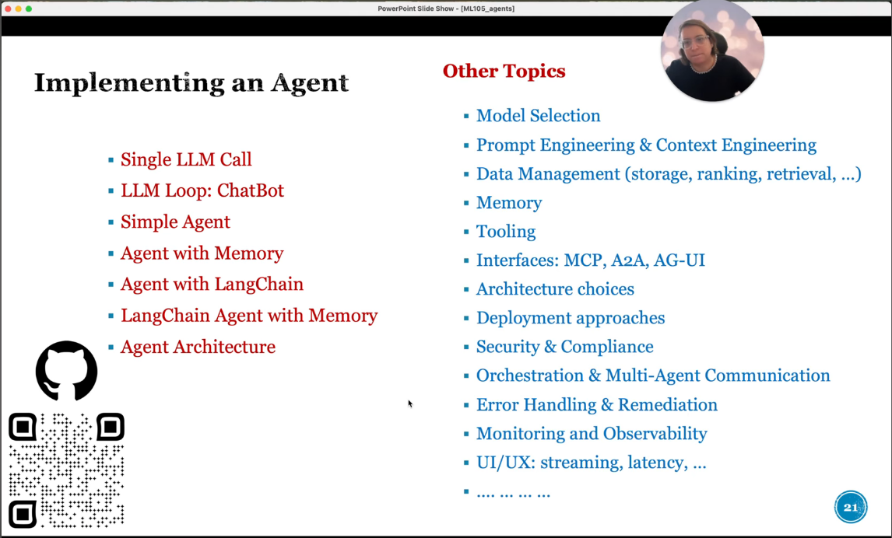

**Main Point:**
The slide frames implementation as a progression from simple LLM calls toward richer agent architectures while also enumerating the broader engineering topics required for production readiness.

#### What the slide shows

- A left list: single LLM call, LLM loop/chatbot, simple agent, agent with memory, agent with LangChain, LangChain agent with memory, and agent architecture.
- A right list titled “Other Topics”.
- The “Other Topics” list includes model selection, prompt/context engineering, data management, memory, tooling, interfaces such as MCP, A2A, AG-UI, architecture choices, deployment, security/compliance, orchestration/multi-agent communication, error handling/remediation, monitoring/observability, and UI/UX concerns such as streaming and latency.
- A GitHub icon and QR code appear as resource pointers.

#### Core concept

- The slide distinguishes capability-building steps from surrounding systems-engineering concerns.
- Implementation maturity is shown as cumulative: richer agents add memory, orchestration, and architecture layers.
- Production readiness requires much more than simply instantiating an agent framework.

#### Detailed interpretation

- The left-hand progression starts with minimal patterns and advances toward memory-enhanced and framework-based implementations.
- The reference to LangChain is explicit on the slide and therefore part of the visible implementation path.
- The right-hand list broadens the scope from code assembly to system design: interfaces, deployment, compliance, orchestration, remediation, and observability are all named.
- The slide is therefore less a recipe than a map of the engineering surface area of agent implementation.
- The final ellipsis line indicates that the topic list is open-ended rather than exhaustive.

#### Technical implications / engineering relevance

- Agent implementation plans should include both runtime design and operational engineering workstreams, because orchestration quality depends on both.
- Interface protocols, error handling, and monitoring should be planned from the outset rather than retrofitted.
- Framework choice is only one layer in a larger implementation stack.
- The explicit mention of MCP, A2A, and AG-UI indicates that interoperability boundaries are implementation-relevant, not theoretical.

#### Key takeaways

- Agent implementation is a staged progression, not a single code artifact.
- Production concerns extend beyond prompts and loops.
- Interoperability, observability, and compliance are part of the implementation problem.

### Slide 22 – Agentic Architectural Patterns

**Image URI:** `images/slide-22.png`

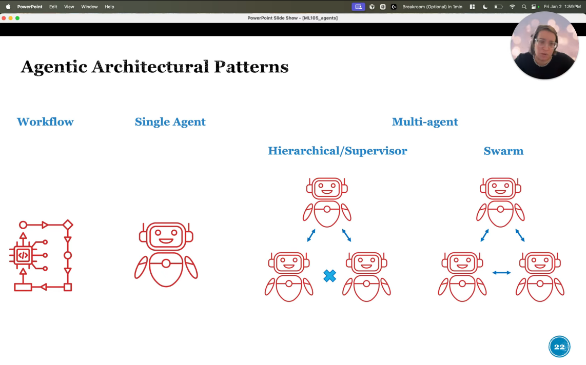

**Main Point:**
The slide compares workflow, single-agent, hierarchical/supervisor multi-agent, and swarm multi-agent patterns as distinct coordination topologies.

#### What the slide shows

- Four labeled patterns: workflow, single agent, multi-agent hierarchical/supervisor, and multi-agent swarm.
- A workflow icon, one standalone agent icon, a supervisor-to-workers arrangement, and a swarm arrangement with peer arrows.
- In the hierarchical pattern, one top agent delegates downward to lower agents.
- In the swarm pattern, peer-to-peer communication is shown among lower agents as well as from the top node.

#### Core concept

- The slide classifies agent systems by coordination topology, not only by agent count.
- A supervisor pattern centralizes control; a swarm pattern distributes coordination more broadly.
- Workflow remains a separate architectural category rather than just a trivial multi-agent case.

#### Detailed interpretation

- The workflow pattern is represented by a flow-graph icon, which suggests static orchestration without agent autonomy.
- The single-agent pattern collapses reasoning and action into one coordinating unit.
- The hierarchical/supervisor pattern introduces explicit delegation from a parent agent to worker agents; the cross symbol between workers suggests that lateral peer coordination is constrained or absent.
- The swarm pattern shows mutual arrows among workers in addition to a higher node, implying richer distributed coordination.
- The slide does not define specific scheduling algorithms or message semantics; it stays at topology level.

#### Technical implications / engineering relevance

- Choosing a pattern affects decomposition strategy, message routing, bottlenecks, and observability design.
- Supervisor patterns can simplify governance and approval control but may centralize failure and latency.
- Swarm patterns can improve flexibility and parallelism but increase coordination complexity and debugging difficulty.
- This pattern taxonomy is directly applicable to multi-agent architecture design, decomposition strategy, and implementation planning.

#### Key takeaways

- Agent systems differ materially by coordination topology.
- Hierarchy and swarm are not interchangeable multi-agent patterns.
- Topology choice has engineering consequences for control, scale, and debuggability.

### Slide 23 – Agent Interface Protocols – Standardization & Interoperability

**Image URI:** `images/slide-23.png`

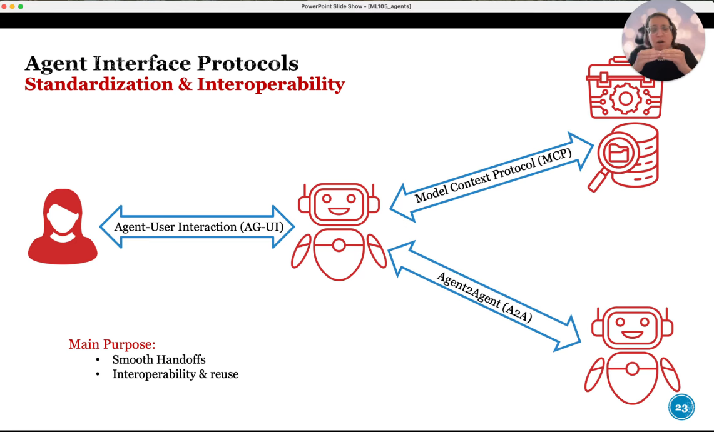

**Main Point:**
The slide positions interface protocols as the mechanism for smooth handoffs and interoperability across user-agent, agent-tool/context, and agent-agent boundaries.

#### What the slide shows

- A central agent connected to a user, a tool/data side, and another agent.
- Three labeled arrows: Agent-User Interaction (AG-UI), Model Context Protocol (MCP), and Agent2Agent (A2A).
- A main-purpose note: smooth handoffs and interoperability & reuse.
- Icons on the tool/data side that suggest systems, tooling, and data access.

#### Core concept

- Interoperability is decomposed into three distinct protocol boundaries.
- User interaction, tool/context access, and inter-agent communication are treated as separate interface classes.
- The slide emphasizes reuse and handoff quality as the outcome of standardization.

#### Detailed interpretation

- AG-UI names the interaction boundary between a human user and an agentic application layer.
- MCP names the boundary between the agent and model-context/tooling/data side of the system.
- A2A names the boundary between agents, which is particularly relevant for multi-agent orchestration patterns.
- The slide does not specify message schemas or transport bindings; it identifies the protocol roles at the architecture level.
- The “smooth handoffs” phrasing implies reduced friction when context or responsibility moves between components.

#### Technical implications / engineering relevance

- Protocol boundaries should be designed explicitly rather than hidden inside framework internals.
- Standardized interfaces can reduce coupling and support component reuse across agentic systems.
- Multi-agent systems especially benefit from consistent handoff semantics, context packaging, and boundary clarity between agent roles.
- Interoperability design is a prerequisite for scalable agent ecosystems, modular execution paths, and reusable protocol-driven handoffs.

#### Key takeaways

- Agentic systems need protocol boundaries at multiple interaction layers.
- Interoperability is about handoff quality and reuse, not only message transport.
- AG-UI, MCP, and A2A describe different but complementary interface domains.

### Slide 24 – Evaluating Agents – Layers of the onion

**Image URI:** `images/slide-24.png`

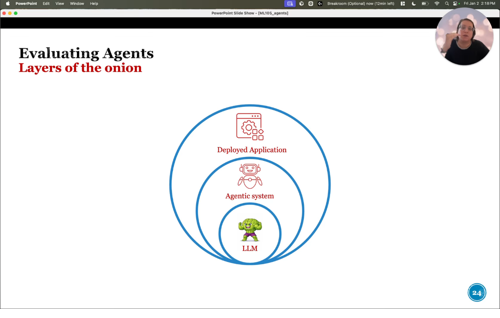

**Main Point:**
The slide argues that evaluation must be layered, with the LLM at the core, the agentic system around it, and the deployed application as the outermost evaluation target.

#### What the slide shows

- Three concentric circles labeled LLM, Agentic system, and Deployed Application.
- The title “Layers of the onion”.
- An onion-like nesting metaphor that visually encloses the inner layers inside the outer layers.
- No metrics yet; the slide establishes evaluation scope and layering.

#### Core concept

- Evaluation should not collapse model quality, agent quality, and application quality into one number.
- The application layer contains the agentic system, which in turn contains the model layer.
- Failures can originate at different layers and therefore require layer-specific diagnosis.

#### Detailed interpretation

- The innermost layer is the LLM, which suggests evaluating core model behavior first.
- The middle layer is the agentic system, which adds orchestration, tool use, memory, and control flow on top of the model.
- The outer layer is the deployed application, which adds full-system concerns such as access control, performance, and user experience.
- The concentric design shows containment: higher layers inherit lower-layer behavior but also introduce new failure modes.
- The slide therefore justifies separate evaluation frameworks for each layer.

#### Technical implications / engineering relevance

- Benchmarks should be stratified by layer so that defects are attributed to the correct system boundary.
- Agent-level improvements may not solve application-level failures such as latency, networking, or identity management.
- Application rollout criteria should include model, agent, and deployment evaluations separately.
- This layered view supports structured observability, incident triage, and evaluation ownership across model, agentic, and application boundaries.

#### Key takeaways

- Evaluation is a layered systems problem.
- LLM, agentic system, and deployed application must be assessed separately.
- The outer application layer introduces concerns not visible in model-only testing.

### Slide 25 – Evaluating Agents – What to evaluate

**Image URI:** `images/slide-25.png`

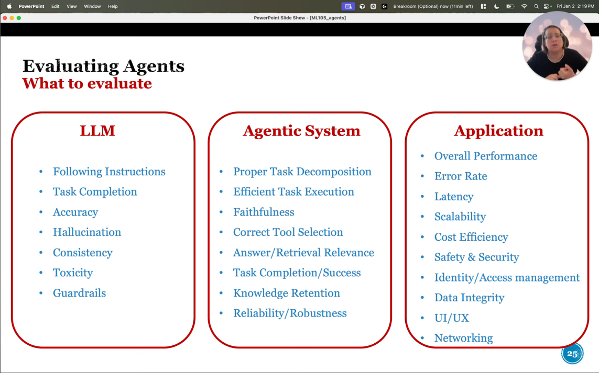

**Main Point:**
The slide specifies three evaluation strata—LLM, agentic system, and application—and assigns different criteria to each.

#### What the slide shows

- Three evaluation columns labeled LLM, Agentic System, and Application.
- LLM criteria: following instructions, task completion, accuracy, hallucination, consistency, toxicity, and guardrails.
- Agentic system criteria: proper task decomposition, efficient task execution, faithfulness, correct tool selection, answer/retrieval relevance, task completion/success, knowledge retention, and reliability/robustness.
- Application criteria: overall performance, error rate, latency, scalability, cost efficiency, safety & security, identity/access management, data integrity, UI/UX, and networking.

#### Core concept

- The slide converts the layered onion into explicit evaluation dimensions.
- The criteria expand from model behavior to orchestration quality to full application operations.
- Application readiness clearly depends on more than model correctness.

#### Detailed interpretation

- The LLM column focuses on behavioral qualities of the base model, including instruction following and hallucination risk.
- The agentic system column introduces orchestration-specific concerns such as task decomposition, correct tool selection, and knowledge retention.
- The application column broadens evaluation into operational and platform concerns such as identity management, networking, security, and UI/UX.
- The structure of the slide implies that high model quality cannot compensate for weak orchestration or weak application engineering.
- The inclusion of faithfulness and relevance in the agentic column highlights grounding and retrieval quality as agent-specific concerns.

#### Technical implications / engineering relevance

- Evaluation plans should be decomposed by layer and owned by appropriate engineering roles.
- Agentic system testing needs path- and tool-aware metrics, not only model metrics.
- Application acceptance criteria should include infrastructure and user experience characteristics alongside agent behavior.
- The slide provides a useful backbone for layered test-strategy documentation, rollout gates, and cross-team evaluation ownership.

#### Key takeaways

- What to evaluate depends on the layer being evaluated.
- Agentic systems introduce new metrics beyond standard LLM evaluation.
- Application-level readiness requires operations, security, and UX criteria.

### Slide 26 – Evaluating Agents – How to evaluate output

**Image URI:** `images/slide-26.png`

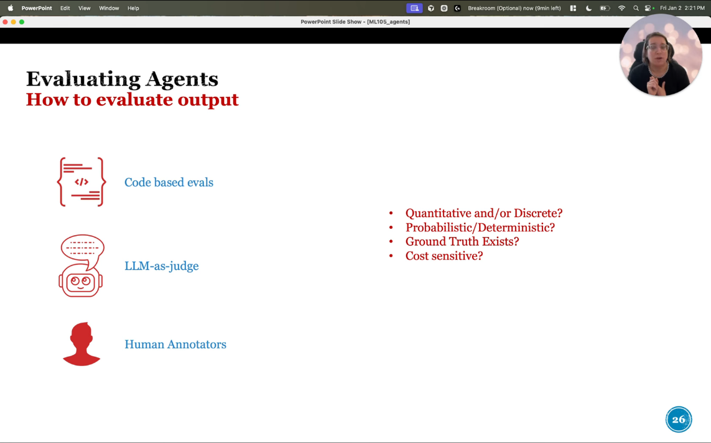

**Main Point:**
The slide identifies three evaluation methods—code-based evals, LLM-as-judge, and human annotators—and ties method choice to output type, determinism, ground-truth availability, and cost sensitivity.

#### What the slide shows

- Three evaluation modalities with icons: code based evals, LLM-as-judge, and human annotators.
- A right-hand checklist asking whether the target is quantitative/discrete, probabilistic/deterministic, whether ground truth exists, and whether the task is cost sensitive.
- A title that focuses specifically on output evaluation rather than system-layer selection.
- The layout is modality-plus-decision-criteria.

#### Core concept

- No single evaluation method is universally appropriate.
- Evaluation modality should match the characteristics of the output and the economics of the evaluation process.
- Ground truth availability is a key branching condition.

#### Detailed interpretation

- Code-based evals are suitable where outputs can be checked mechanically against rules or expected results.
- LLM-as-judge is presented as a separate modality, implying model-mediated assessment for cases where rigid scoring is insufficient.
- Human annotators remain necessary where judgment, nuance, or ambiguous correctness matters.
- The question set on the right is effectively a method-selection rubric: discrete outputs and available ground truth point toward automated scoring; more probabilistic or open-ended outputs may require model or human judgment.
- Cost sensitivity appears explicitly, which indicates that evaluation design is also a resource-allocation decision.

#### Technical implications / engineering relevance

- Evaluation pipelines should mix modalities depending on artifact type and risk level.
- High-stakes or ambiguous outputs may need human review even if automated evals exist.
- LLM-as-judge introduces its own calibration and reliability questions and should not be treated as infallible.
- Evaluation strategy itself should be documented as part of production readiness, especially where layered systems mix model, tool, and workflow behavior.

#### Key takeaways

- Output evaluation method should be chosen deliberately.
- Ground truth, determinism, and cost shape the right evaluation approach.
- Human review remains part of the evaluation toolbox.

### Slide 27 – Agents: Technology Frontier – Agent Challenges

**Image URI:** `images/slide-27.png`

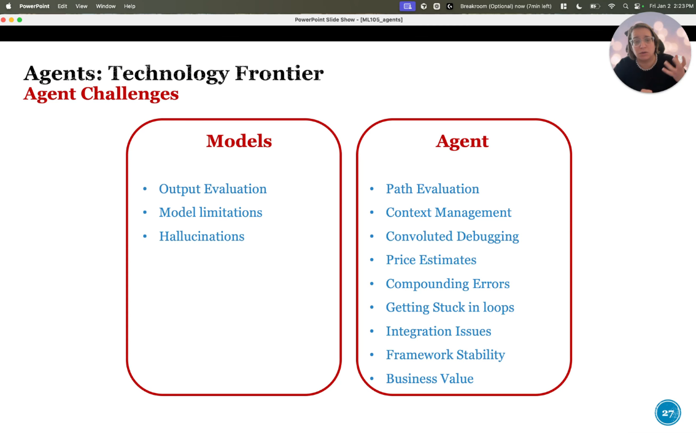

**Main Point:**
The slide separates frontier challenges into model-side issues and agent-side issues, making clear that many practical problems arise above the base model layer.

#### What the slide shows

- Two columns labeled Models and Agent.
- Model-side challenges: output evaluation, model limitations, and hallucinations.
- Agent-side challenges: path evaluation, context management, convoluted debugging, price estimates, compounding errors, getting stuck in loops, integration issues, framework stability, and business value.
- The agent column is longer, visually suggesting a broader systems-engineering challenge surface.

#### Core concept

- The slide distinguishes model defects from agent-system defects.
- Agent engineering introduces failure modes that do not exist in isolated model benchmarking.
- Business value is included as a frontier challenge, which broadens the framing beyond purely technical execution.

#### Detailed interpretation

- Output evaluation and hallucinations remain model-side concerns, but the agent column moves the focus toward execution-path and integration complexity.
- Path evaluation highlights the need to assess not only final answers but also the sequence of reasoning and tool actions.
- Context management and compounding errors point to state-handling risks that emerge in iterative loops.
- Convoluted debugging and framework stability indicate that implementation complexity can become a major bottleneck.
- The inclusion of price estimates and business value shows that frontier challenges include economic justification and operating cost, not only technical correctness.

#### Technical implications / engineering relevance

- Production agent programs need diagnostics, cost tracking, and path-level observability in addition to model evaluation, particularly when multiple tools or agents participate in one execution path.
- Debuggability should be treated as an architecture requirement because agent failures can be distributed across multiple layers.
- Loop control and context management need explicit safeguards to avoid runaway or degraded execution.
- Business-value validation should accompany technical validation when prioritizing agent investments.

#### Key takeaways

- Agent challenges extend materially beyond base-model challenges.
- Path evaluation, debugging, and integration are central frontier problems.
- Economic viability is part of the engineering challenge set.

### Slide 28 – Agents: Technology Frontier – Best Practices

**Image URI:** `images/slide-28.png`

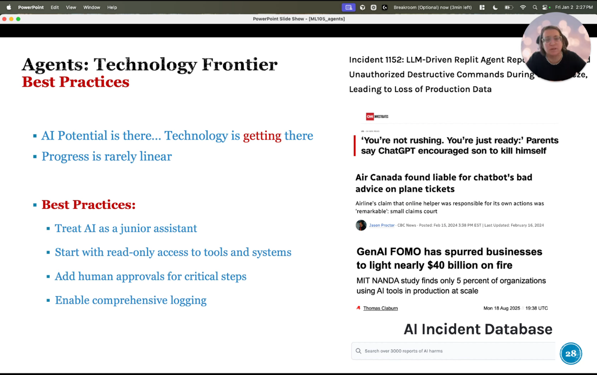

**Main Point:**
The slide recommends conservative deployment practice: treat AI as a junior assistant, start with read-only access, add human approvals for critical steps, and enable comprehensive logging.

#### What the slide shows

- Two positioning statements: AI potential is present but technology is still catching up, and progress is rarely linear.
- A best-practices list: treat AI as a junior assistant, start with read-only access to tools and systems, add human approvals for critical steps, and enable comprehensive logging.
- A right-hand collage of incident material, including an incident headline about unauthorized destructive commands during a code freeze leading to loss of production data.
- Additional visible examples include severe chatbot-advice headlines, an article about GenAI FOMO destroying business value, and the AI Incident Database.

#### Core concept

- The slide uses incident evidence to justify conservative deployment controls.
- Human oversight, limited permissions, and logging are positioned as baseline guardrails.
- The “junior assistant” framing implies bounded trust and staged empowerment.

#### Detailed interpretation

- The first two bullets establish the slide’s overall stance: the technology is promising but uneven, and progress is not reliably monotonic.
- The read-only recommendation is a concrete least-privilege control for tool mediation.
- Human approvals for critical steps establish an approval gate for high-impact actions.
- Comprehensive logging is presented as an operational necessity for auditability, incident analysis, and debugging.
- The incident collage on the right grounds these recommendations in visible examples of harmful or costly behavior, rather than leaving them as abstract safety principles.

#### Technical implications / engineering relevance

- Least-privilege tool design should be the default for early deployments.
- Critical actions should remain behind human confirmation or deterministic control points.
- Logging should capture prompts, tool calls, decisions, outputs, and external effects where policy permits.
- Incident-informed engineering is essential for production readiness in agentic systems, especially where tool permissions, approvals, and external effects must be controlled explicitly.

#### Key takeaways

- Deploy agents conservatively and progressively.
- Human approval and read-only access are practical early-stage controls.
- Logging is foundational for reliability and remediation.

### Slide 29 – Will Agents Take My Job? … Maybe… Not just yet

**Image URI:** `images/slide-29.png`

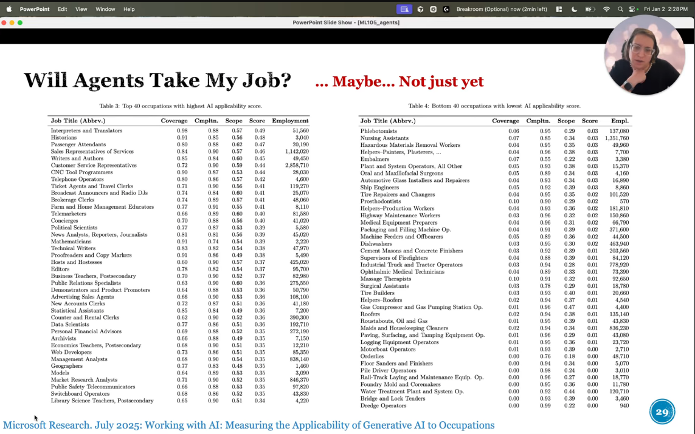

**Main Point:**
The slide argues against a simplistic job-replacement narrative by showing a research-based spread of occupations with high versus low AI applicability scores.

#### What the slide shows

- Two large tables: top 40 occupations with highest AI applicability score and bottom 40 occupations with lowest AI applicability score.
- Column headers include job title, coverage, completion, scope, score, and employment.
- The bottom citation attributes the source to Microsoft Research, July 2025: “Working with AI: Measuring the Applicability of Generative AI to Occupations”.
- The title includes the qualifier “… Maybe… Not just yet”.

#### Core concept

- AI applicability is presented as uneven across occupations rather than universal.
- The slide shifts the question from total replacement to differentiated task applicability.
- Applicability is operationalized through multiple attributes, not a single binary label.

#### Detailed interpretation

- The high-applicability table begins with roles such as interpreters and translators and includes other communication- or information-centric occupations.
- The low-applicability table begins with roles such as phlebotomists and nursing assistants and includes other physically grounded or environment-dependent occupations.
- The use of separate columns for coverage, completion, scope, and overall score indicates that applicability is multi-dimensional.
- The source citation makes clear that this slide is grounded in an occupation study rather than anecdotal prediction.
- The title’s qualifier signals that any labor impact discussion should be nuanced and staged.

#### Technical implications / engineering relevance

- Workforce-impact analysis should be task-level and occupation-specific.
- Agent adoption is more likely to reshape work composition than eliminate all categories uniformly.
- Roles with strong information-processing components may be more exposed to agentic augmentation or automation.
- Engineering teams should avoid overgeneralizing from AI capability demos to labor-market outcomes.

#### Key takeaways

- AI applicability is uneven across occupations.
- Task structure matters more than headline-level replacement narratives.
- The slide supports a differentiated, evidence-oriented view of job impact.

### Slide 30 – Will Agents Take My Job? Moravec’s paradox

**Image URI:** `images/slide-30.png`

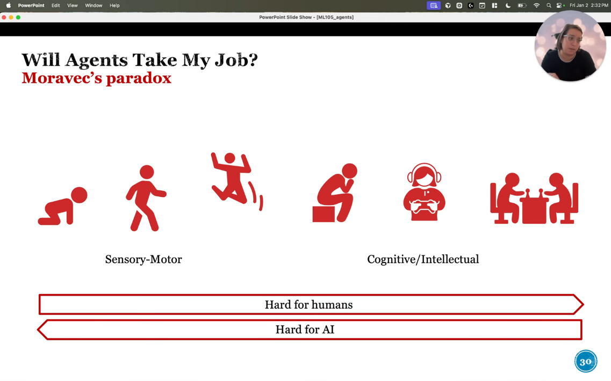

**Main Point:**
The slide uses Moravec’s paradox to argue that sensory-motor tasks and cognitive/intellectual tasks do not align neatly with what is hard for humans versus what is hard for AI.

#### What the slide shows

- Icons representing crawling, walking, jumping, thinking, gaming, and social interaction.
- A left-right grouping labeled sensory-motor and cognitive/intellectual.
- Two bottom arrows: one labeled “Hard for humans” and one labeled “Hard for AI”.
- The paradox is the conceptual title of the slide.

#### Core concept

- The slide challenges naive assumptions that human difficulty and AI difficulty track each other directly.
- Embodied and sensory-motor competence remain distinct from purely symbolic or textual competence.
- The paradox is used as a labor-impact and capability-framing concept.

#### Detailed interpretation

- The sensory-motor side depicts basic physical abilities that humans perform naturally but which remain difficult to replicate robustly in AI-driven systems.
- The cognitive/intellectual side depicts tasks often regarded as more “intellectual”, yet some of these have become relatively approachable for contemporary AI systems.
- The opposing bottom arrows imply a mismatch: what is hard for humans is not necessarily what is hard for AI, and vice versa.
- The slide therefore supports the broader argument that job impact cannot be inferred from prestige or perceived complexity alone.

#### Technical implications / engineering relevance

- Capability roadmaps should distinguish embodied execution from abstract reasoning or language generation.
- Automation forecasts need to account for environment interaction, perception, and control, not only text or code benchmarks.
- Agentic software systems may advance faster in symbolic domains than in physically grounded domains.
- This slide supports nuanced partitioning of automation boundaries in systems and workforce planning.

#### Key takeaways

- Human and AI difficulty profiles are not aligned in a simple way.
- Embodied competence remains a major boundary.
- Moravec’s paradox is relevant when assessing job impact and automation scope.

### Slide 31 – Will Agents Take My Job? Software Development

**Image URI:** `images/slide-31.png`

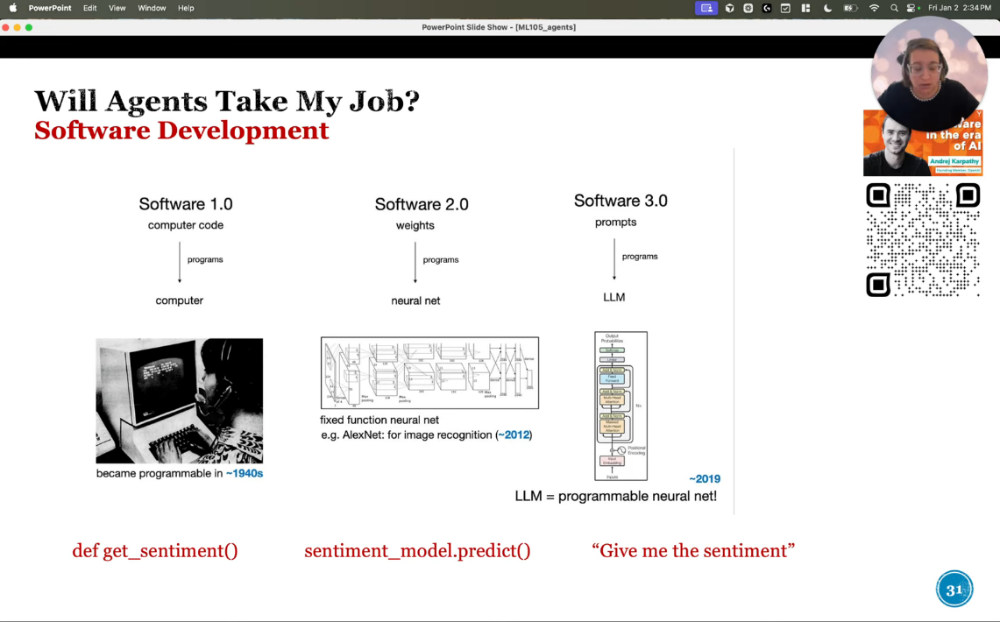

**Main Point:**
The slide reframes software development as an abstraction ladder from Software 1.0 code to Software 2.0 weights to Software 3.0 prompts, with LLMs presented as programmable neural networks.

#### What the slide shows

- Three columns: Software 1.0 (computer code), Software 2.0 (weights), and Software 3.0 (prompts).
- Each column maps “programs” to a compute substrate: computer, neural net, and LLM.
- Historical cues: programmable computers in the ~1940s, fixed-function neural nets such as AlexNet around ~2012, and LLM as programmable neural net around ~2019.
- Bottom examples: `def get_sentiment()`, `sentiment_model.predict()`, and “Give me the sentiment”.

#### Core concept

- The slide argues that the programming interface changes across software eras, but programmability remains central.
- Prompts are framed as a new programming surface rather than a replacement for software engineering.
- The LLM is positioned as a programmable substrate, analogous to earlier computing abstractions.

#### Detailed interpretation

- The Software 1.0 column represents explicit symbolic coding against conventional computers.
- The Software 2.0 column represents learned behavior encoded in neural-network weights rather than handcrafted symbolic logic.
- The Software 3.0 column represents behavioral specification through prompts applied to an LLM substrate.
- The bottom examples make the transition concrete: a function definition becomes a model-prediction call, which then becomes a natural-language prompt instruction.
- The slide does not claim that older layers disappear; it shows an abstraction shift in how behavior is specified.

#### Technical implications / engineering relevance

- Developer workflows may increasingly combine conventional code, trained models, and prompt-level behavioral programming.
- Agentic system design needs disciplined interfaces between these layers rather than treating prompting as a total replacement for software engineering.
- Evaluation and versioning practices must adapt to non-deterministic and prompt-mediated execution paths.
- The slide supports a view of agentic development as a new programming paradigm layered on prior ones.

#### Key takeaways

- Software development is shifting toward additional abstraction layers, not a single replacement event.
- Prompts are presented as a programmable interface to LLM behavior.
- Software 1.0, 2.0, and 3.0 coexist as different design surfaces.

### Slide 32 – Will Agents Take My Job? Weathering the Storm

**Image URI:** `images/slide-32.png`

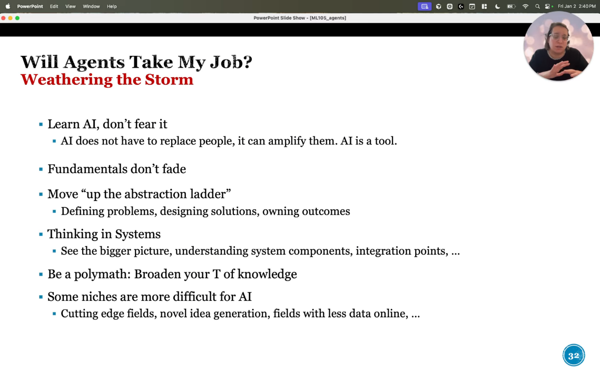

**Main Point:**
The slide recommends adaptation strategies: learn AI, move up the abstraction ladder, think in systems, broaden skill breadth, and focus on niches where AI remains weaker.

#### What the slide shows

- A bullet list beginning with “Learn AI, don’t fear it”.
- A subpoint that AI does not have to replace people; it can amplify them and is a tool.
- Additional bullets on fundamentals, moving up the abstraction ladder, thinking in systems, broadening one’s T-shaped knowledge, and focusing on niches more difficult for AI.
- Examples of difficult niches include cutting-edge fields, novel idea generation, and fields with less data online.

#### Core concept

- The slide advocates adaptation through abstraction, systems thinking, and breadth rather than resistance.
- AI is framed as an amplifier rather than an inherently total replacement mechanism.
- Domain scarcity and novelty are presented as relative protective factors.

#### Detailed interpretation

- The call to learn AI is paired with the claim that AI can amplify people, which frames the transition as augmentation-first.
- The “fundamentals don’t fade” point argues that core engineering knowledge retains value across technology shifts.
- Moving up the abstraction ladder is described concretely as defining problems, designing solutions, and owning outcomes.
- Thinking in systems is tied to seeing the bigger picture and understanding system components and integration points.
- The slide further recommends becoming a polymath by broadening the “T” of knowledge and highlights low-data or cutting-edge areas as harder targets for AI.

#### Technical implications / engineering relevance

- Engineering education and career development should emphasize system design, integration, and problem framing.
- Specialization remains useful, but breadth across adjacent domains becomes more valuable in agent-augmented environments.
- Human comparative advantage may persist in novel, sparse-data, and cross-disciplinary problem spaces.
- The slide implicitly supports human-in-the-loop, AI-augmented engineering workflows.

#### Key takeaways

- Adaptation strategy matters more than fear narratives.
- Abstraction, systems thinking, and breadth remain durable advantages.
- Novel and data-sparse domains remain relatively resistant to straightforward automation.

### Slide 33 – References

**Image URI:** `images/slide-33.png`

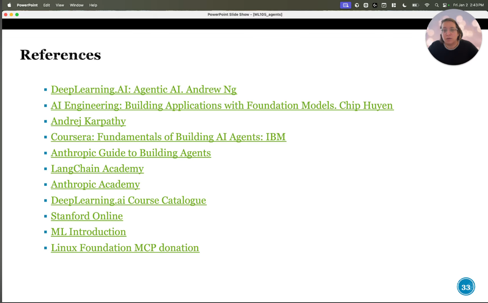

**Main Point:**
The slide provides the explicit source list for the deck, covering courses, authors, guides, and standards-related resources named on the slide.

#### What the slide shows

- A references list containing: DeepLearning.AI: Agentic AI. Andrew Ng; AI Engineering: Building Applications with Foundation Models. Chip Huyen; Andrej Karpathy; Coursera: Fundamentals of Building AI Agents: IBM; Anthropic Guide to Building Agents; LangChain Academy; Anthropic Academy; DeepLearning.ai Course Catalogue; Stanford Online; ML Introduction; Linux Foundation MCP donation.
- Each item appears as a separate linked-looking line in green text.
- The slide contains no diagram; it is purely bibliographic/resource oriented.
- The list mixes educational resources, named authors, and protocol-related material.

#### Core concept

- The slide anchors the deck in a visible resource base.
- The reference set spans agentic AI education, application engineering, and protocol/interoperability material.
- It also shows that the deck draws from multiple ecosystems rather than a single framework vendor.

#### Detailed interpretation

- Andrew Ng and Chip Huyen are named directly in two of the listed resources.
- IBM and Anthropic appear in educational or guide resources, while LangChain Academy is explicitly included as a learning resource.
- The Linux Foundation MCP donation entry is particularly relevant to the protocol slide because MCP was referenced earlier in the deck.
- The slide does not provide publication metadata beyond the names shown, so the reference treatment remains lightweight.
- Because the deck includes these items explicitly, they are part of the visible evidence base for the presentation.

#### Technical implications / engineering relevance

- The reference list can be used as a starting point for deeper engineering study on agent design and interoperability.
- Protocol and tooling literacy are part of the recommended learning path, not peripheral topics.
- The mix of foundational and practical sources aligns with the deck’s design-and-implementation orientation.
- For handbook reuse, this slide provides a visible provenance list for subsequent reading.

#### Key takeaways

- The deck cites a concrete set of educational and technical resources.
- Interoperability and agent-building guidance are both represented.
- The source base is heterogeneous and implementation-oriented.

### Slide 34 – Thank You

**Image URI:** `images/slide-34.png`

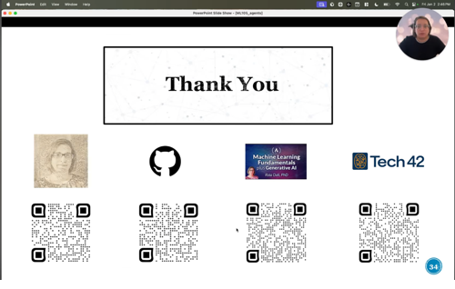

**Main Point:**
The closing slide functions as an end card and resource handoff, showing QR codes and logos that point to the presenter’s or course-related destinations.

#### What the slide shows

- A large “Thank You” title.
- Multiple QR codes arranged along the bottom.
- Visible logos/images including GitHub, a machine-learning fundamentals image, Tech42, and a portrait-like image on the left.
- No new technical content or conceptual diagram.

#### Core concept

- The slide is a resource and attribution endpoint rather than a content slide.
- Its main function is continuity beyond the presentation via scannable links.
- It closes the deck without introducing new architecture claims.

#### Detailed interpretation

- The repeated QR-code format indicates several distinct follow-up resources or destinations.
- The GitHub logo suggests code or repository-oriented follow-up material.
- The presence of course/book imagery and organizational branding suggests that the deck is tied to a broader learning or community context.
- Because no descriptive labels are provided for each QR code, the precise destination of each code is not inferable from the image alone.

#### Technical implications / engineering relevance

- For handbook purposes, the slide has limited technical value but does document that the deck expects external follow-up resources.
- It indicates that implementation material may exist outside the slide set, potentially in repositories or linked educational assets.
- No engineering conclusions should be drawn from this slide beyond resource availability and deck closure.

#### Key takeaways

- This is a closing and resource-handoff slide.
- Its content is logistical rather than technical.
- QR-linked follow-up material exists, but destinations are not fully identifiable from the slide alone.

## Appendix – Image Reference by Chapter

### Appendix A – Slide 7 – GenAI, Agentic Systems and the spectrum of Autonomy

- Related chapter: `Slide 7 – GenAI, Agentic Systems and the spectrum of Autonomy`
- Image URI: `images/slide-07.png`
- Notes:
  - best available version used
  - standalone slide image used from the extracted archives

### Appendix A – Slide 9 – What is an Agent?

- Related chapter: `Slide 9 – What is an Agent?`
- Image URI: `images/slide-09.png`
- Notes:
  - best available version used
  - alternate capture observed in the inventory; the clearest readable version was retained for the main body
  - standalone slide image used from the extracted archives

### Appendix A – Slide 10 – What is an Agent?

- Related chapter: `Slide 10 – What is an Agent?`
- Image URI: `images/slide-10.png`
- Notes:
  - best available version used
  - alternate capture observed in the inventory; the clearest readable version was retained for the main body
  - standalone slide image used from the extracted archives

### Appendix A – Slide 11 – What is an Agent? Agents vs Workflows

- Related chapter: `Slide 11 – What is an Agent? Agents vs Workflows`
- Image URI: `images/slide-11.png`
- Notes:
  - best available version used
  - standalone slide image used from the extracted archives

### Appendix A – Slide 12 – Agent Use Cases

- Related chapter: `Slide 12 – Agent Use Cases`
- Image URI: `images/slide-12.png`
- Notes:
  - best available version used
  - standalone slide image used from the extracted archives

### Appendix A – Slide 13 – Patterns and Anti-Patterns for Agents – When to use, or not to use an agent

- Related chapter: `Slide 13 – Patterns and Anti-Patterns for Agents – When to use, or not to use an agent`
- Image URI: `images/slide-13.png`
- Notes:
  - best available version used
  - standalone slide image used from the extracted archives

### Appendix A – Slide 14 – Patterns and Anti-Patterns for Agents – When to use, or not to use an agent

- Related chapter: `Slide 14 – Patterns and Anti-Patterns for Agents – When to use, or not to use an agent`
- Image URI: `images/slide-14.png`
- Notes:
  - best available version used
  - standalone slide image used from the extracted archives

### Appendix A – Slide 15 – Components of an Agent

- Related chapter: `Slide 15 – Components of an Agent`
- Image URI: `images/slide-15.png`
- Notes:
  - best available version used
  - Cropped from selected_sheet_2.png because no standalone slide image was present in the extracted archives.

### Appendix A – Slide 16 – Designing an Agent

- Related chapter: `Slide 16 – Designing an Agent`
- Image URI: `images/slide-16.png`
- Notes:
  - best available version used
  - standalone slide image used from the extracted archives

### Appendix A – Slide 17 – Designing an Agent – Choosing an LLM

- Related chapter: `Slide 17 – Designing an Agent – Choosing an LLM`
- Image URI: `images/slide-17.png`
- Notes:
  - best available version used
  - standalone slide image used from the extracted archives

### Appendix A – Slide 18 – Designing an Agent – System prompt

- Related chapter: `Slide 18 – Designing an Agent – System prompt`
- Image URI: `images/slide-18.png`
- Notes:
  - best available version used
  - alternate capture observed in the inventory; the clearest readable version was retained for the main body
  - standalone slide image used from the extracted archives

### Appendix A – Slide 19 – Designing an Agent – Memory

- Related chapter: `Slide 19 – Designing an Agent – Memory`
- Image URI: `images/slide-19.png`
- Notes:
  - best available version used
  - standalone slide image used from the extracted archives

### Appendix A – Slide 20 – Designing an Agent – Actions & Tools

- Related chapter: `Slide 20 – Designing an Agent – Actions & Tools`
- Image URI: `images/slide-20.png`
- Notes:
  - best available version used
  - standalone slide image used from the extracted archives

### Appendix A – Slide 21 – Implementing an Agent

- Related chapter: `Slide 21 – Implementing an Agent`
- Image URI: `images/slide-21.png`
- Notes:
  - best available version used
  - alternate capture observed in the inventory; the clearest readable version was retained for the main body
  - standalone slide image used from the extracted archives

### Appendix A – Slide 22 – Agentic Architectural Patterns

- Related chapter: `Slide 22 – Agentic Architectural Patterns`
- Image URI: `images/slide-22.png`
- Notes:
  - best available version used
  - standalone slide image used from the extracted archives

### Appendix A – Slide 23 – Agent Interface Protocols – Standardization & Interoperability

- Related chapter: `Slide 23 – Agent Interface Protocols – Standardization & Interoperability`
- Image URI: `images/slide-23.png`
- Notes:
  - best available version used
  - alternate capture observed in the inventory; the clearest readable version was retained for the main body
  - standalone slide image used from the extracted archives

### Appendix A – Slide 24 – Evaluating Agents – Layers of the onion

- Related chapter: `Slide 24 – Evaluating Agents – Layers of the onion`
- Image URI: `images/slide-24.png`
- Notes:
  - best available version used
  - Cropped from selected_sheet_5.png because no standalone slide image was present in the extracted archives.

### Appendix A – Slide 25 – Evaluating Agents – What to evaluate

- Related chapter: `Slide 25 – Evaluating Agents – What to evaluate`
- Image URI: `images/slide-25.png`
- Notes:
  - best available version used
  - standalone slide image used from the extracted archives

### Appendix A – Slide 26 – Evaluating Agents – How to evaluate output

- Related chapter: `Slide 26 – Evaluating Agents – How to evaluate output`
- Image URI: `images/slide-26.png`
- Notes:
  - best available version used
  - standalone slide image used from the extracted archives

### Appendix A – Slide 27 – Agents: Technology Frontier – Agent Challenges

- Related chapter: `Slide 27 – Agents: Technology Frontier – Agent Challenges`
- Image URI: `images/slide-27.png`
- Notes:
  - best available version used
  - standalone slide image used from the extracted archives

### Appendix A – Slide 28 – Agents: Technology Frontier – Best Practices

- Related chapter: `Slide 28 – Agents: Technology Frontier – Best Practices`
- Image URI: `images/slide-28.png`
- Notes:
  - best available version used
  - alternate capture observed in the inventory; the clearest readable version was retained for the main body
  - standalone slide image used from the extracted archives

### Appendix A – Slide 29 – Will Agents Take My Job? … Maybe… Not just yet

- Related chapter: `Slide 29 – Will Agents Take My Job? … Maybe… Not just yet`
- Image URI: `images/slide-29.png`
- Notes:
  - best available version used
  - standalone slide image used from the extracted archives

### Appendix A – Slide 30 – Will Agents Take My Job? Moravec’s paradox

- Related chapter: `Slide 30 – Will Agents Take My Job? Moravec’s paradox`
- Image URI: `images/slide-30.png`
- Notes:
  - best available version used
  - alternate capture observed in the inventory; the clearest readable version was retained for the main body
  - standalone slide image used from the extracted archives

### Appendix A – Slide 31 – Will Agents Take My Job? Software Development

- Related chapter: `Slide 31 – Will Agents Take My Job? Software Development`
- Image URI: `images/slide-31.png`
- Notes:
  - best available version used
  - alternate capture observed in the inventory; the clearest readable version was retained for the main body
  - standalone slide image used from the extracted archives

### Appendix A – Slide 32 – Will Agents Take My Job? Weathering the Storm

- Related chapter: `Slide 32 – Will Agents Take My Job? Weathering the Storm`
- Image URI: `images/slide-32.png`
- Notes:
  - best available version used
  - alternate capture observed in the inventory; the clearest readable version was retained for the main body
  - standalone slide image used from the extracted archives

### Appendix A – Slide 33 – References

- Related chapter: `Slide 33 – References`
- Image URI: `images/slide-33.png`
- Notes:
  - best available version used
  - standalone slide image used from the extracted archives

### Appendix A – Slide 34 – Thank You

- Related chapter: `Slide 34 – Thank You`
- Image URI: `images/slide-34.png`
- Notes:
  - best available version used
  - Cropped from selected_sheet_7.png because no standalone slide image was present in the extracted archives.

